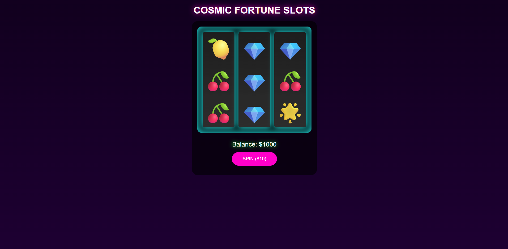

# Slots Game v1.20

A classic 3-reel slot machine built with **pure HTML, CSS, and JavaScript** — no libraries, no frameworks.

Showcasing smooth animations, precise timing, clean loops, and smart `if` logic.

<br>

## Live Demo

<p align="center">
  <a href="https://yourusername.github.io/slots-game" target="_blank">
    
  </a>
</p>

<p align="center">
  <strong>Click the image above to play instantly! (or <a href="https://yourusername.github.io/slots-game" target="_blank">open in new tab</a>)</strong>
</p>

<br>

## Features

- Ultra-smooth reel spinning with motion blur and realistic easing
- Staggered reel stops (left → center → right)
- Win detection: 3-of-a-kind = big payout, 2-of-a-kind = small win
- $10 fixed bet with live balance tracking
- Fully responsive — looks great on phone, tablet, and desktop
- Press **Spacebar** to spin instantly
- No dependencies — just one `index.html` file

## Skills Demonstrated

```js
Smooth looping animations with CSS transforms
Precise staggered timing using setTimeout()
Complex if/else win condition logic
DOM manipulation & real-time updates
Game state management (balance, spinning state)
Performance-optimized animations (will-change, requestAnimationFrame)
Clean, readable vanilla JavaScript
